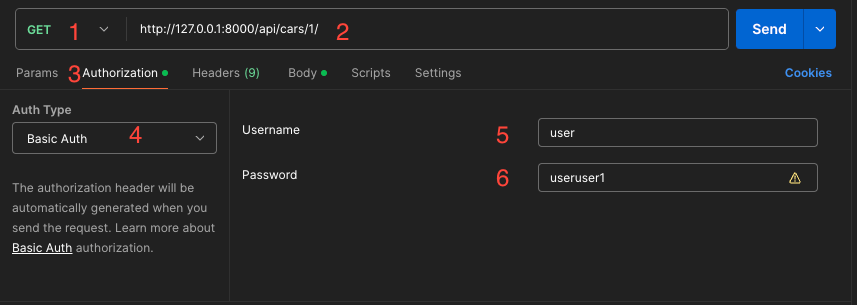
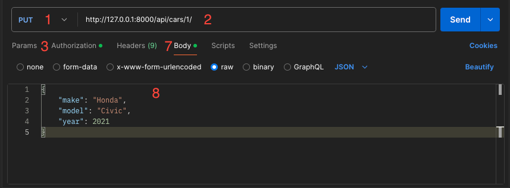

# AvtoInfo

## Начало работы

### Чтобы начать работу с этим проектом, выполните следующие шаги:

### Предварительные требования
```
Перед началом работы убедитесь, что на вашем компьютере установлены следующие инструменты:
```
- [Git](https://git-scm.com/)
- [Docker](https://www.docker.com/)


### Установка

1. **Клонируйте репозиторий:**
```
Откройте терминал и выполните следующую команду для клонирования репозитория:
```
```bash
git clone https://github.com/1eo1eo1eo/AvtoInfo.git
```

2. **Перейдите в директорию проекта:**
```bash
cd AvtoInfo
```


3. **Запустите скрипт настройки:**
```
После клонирования репозитория выполните следующий скрипт, который автоматически:

    Соберет и запустит Docker-контейнеры
    Установит необходимые зависимости
    Применит миграции для настройки базы данных
    Загрузит начальные данные (пользователи, автомобили, комментарии)
    Запустит сервер разработки Django

```
**Для этого запустите следующую команду:**
```bash
scripts/start.sh
```


**Доступ к приложению**
```
После успешного выполнения скрипта сервер разработки будет запущен,
и вы сможете открыть приложение в браузере по следующему адресу:
```

- [http://127.0.0.1:8000/](http://127.0.0.1:8000/) или 
[http://localhost:8000/](http://localhost:8000/)

```
superuser:    
    username: admin    
    password: 1    
default user:    
    username: user    
    password: useruser1        
```

**Для остановки приложения запустите следующую команду:**
```bash
scripts/stop.sh
```

---

# Тестирование API с помощью Postman

    Установка Postman: https://www.postman.com/downloads/
    Запустите сервер django перед тестированием


Тестирование API-ручек
1. Получение списка автомобилей:

    1.Метод: GET    
    2.URL: http://127.0.0.1:8000/api/cars/          
    3.Authorization:    
    4.Auth Type - Basic Auth    
    5.username: user    
    6.password: useruser1    
    ### Send

    
    

2. Получение информации о конкретном автомобиле:

    1.Метод: GET    
    2.URL: http://127.0.0.1:8000/api/cars/< id >/   
    3.Authorization:    
    4.Auth Type - Basic Auth    
    5.username: user    
    6.password: useruser1   
    ### Send

    

3. Создание нового автомобиля:

    1.Метод: POST   
    2.URL: http://127.0.0.1:8000/api/cars/  
    3.Authorization:    
    4.Auth Type - Basic Auth    
    5.username: user    
    6.password: useruser1   
    7.Body      
    8.В формате JSON укажите данные нового автомобиля, например:    
    {
      "make": "Toyota",
      "model": "Corolla",
      "year": 2020 
    }   
    ### Send

    

4. Обновление информации об автомобиле:

    1.Метод: PUT    
    2.URL: http://127.0.0.1:8000/api/cars/< id >/   
    3.Authorization:    
    4.Auth Type - Basic Auth    
    5.username: user    
    6.password: useruser1   
    7.Body       
    8.В формате JSON укажите данные нового автомобиля, например:    
    {
      "make": "Honda",
      "model": "Civic",
      "year": 2021
    }   
    ### Send

    

5. Удаление автомобиля:

    1.Метод: DELETE     
    2.URL: http://127.0.0.1:8000/api/cars/< id >/   
    3.Authorization:    
    4.Auth Type - Basic Auth    
    5.username: user    
    6.password: useruser1   
    ### Send

    

6. Получение комментариев к автомобилю:

    1.Метод: GET    
    2.URL: http://127.0.0.1:8000/api/cars/< id >/comments/  
    3.Authorization:    
    4.Auth Type - Basic Auth    
    5.username: user    
    6.password: useruser1   
    ### Send

    

7. Добавление комментария к автомобилю:

    1.Метод: POST   
    2.URL: http://127.0.0.1:8000/api/cars/< id >/comments/  
    3.Authorization:    
    4.Auth Type - Basic Auth    
    5.username: user    
    6.password: useruser1  
    7.Body    
    8.В формате JSON укажите данные нового автомобиля, например:   
    {
    "content": "This car is amazing!"
    }   
    ### Send

    
